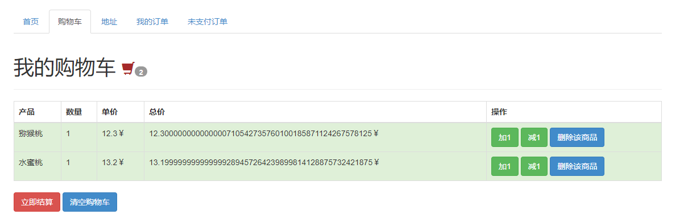

# 购物订单微服务DEMO

## 1、微服务架构

- mygateway：微服务网关、jwt登录验证、RequestRateLimiter限流
- order：订单处理微服务，包括下单处理，订单取消，支付宝发起支付，下单减库存时使用 Redisson 锁，防止并发问题
  - 支付时，由于用户可能在支付页面后并不进行操作了，所以我使用了 RabbitMQ 的死信队列，将订单数据放入该队列。15 分钟后，接收到订单信息再发起支付宝的订单查询，确认订单状态。如果订单已支付，再更新订单状态。
- order-eureka：eureka注册中心
- order-user：用户登录、物品展示、地址填写和前端模板页面

## 2、页面展示

- 点击登录后，后端会返回jwt的token信息，将token信息放入请求头 authorization 中，即可访问。由于前端能力有限，需要手动放入请求头

- 商品列表展示页面，简单的展示一下可购买商品

- 地址填写页面，下单时使用默认地址进行下单

- 购物车页面，使用的是 thymeleaf 模板引擎，我也不晓得为啥这么多小数

- 支付结算确认页面，这里的价格小数点就正常了
- 点击提交后，跳转到支付宝沙箱环境的支付页面。